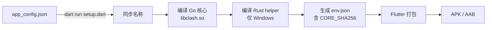

# Android 构建指南

## 环境要求

- Flutter SDK（项目所用版本）
- Android NDK（用于编译 Go 核心库）
- Go 1.20+
- Android Studio / SDK

## 构建分架构 APK（默认方式）

每个命令只构建一个架构，产出独立的 APK 文件：

```powershell
# arm64（主流 64 位设备）
dart run setup.dart android --arch arm64

# arm（32 位旧设备）
dart run setup.dart android --arch arm

# amd64 / x86_64（模拟器）
dart run setup.dart android --arch amd64
```

产物在 `build/app/outputs/flutter-apk/` 目录下。

## 构建胖包（Universal APK）

胖包包含三种架构，一个 APK 通用所有设备。

### 第一步：分别编译各架构 Go 核心库

```powershell
dart run setup.dart android --arch arm64 --out core
dart run setup.dart android --arch arm --out core
dart run setup.dart android --arch amd64 --out core
```

> `--out core` 表示只构建核心库，不进行 Flutter 打包。
> 产物输出到 `libclash/android/` 目录下。

### 第二步：打包通用 APK

```powershell
flutter build apk --release --target-platform android-arm,android-arm64,android-x64 --dart-define-from-file=env.json
```

产物：`build/app/outputs/flutter-apk/app-release.apk`

## 构建流程图



## 注意事项

- 胖包体积较大，因为同时包含三个架构的 so 文件
- 如果只需发布到 Google Play，建议使用 Android App Bundle（AAB）替换命令中的 `apk` 为 `appbundle`
- 每次修改 `app_config.json` 后重新构建会自动同步名称
