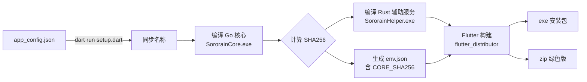

# Windows 构建指南

## 环境要求

- **Flutter SDK**（项目所用版本，含 Windows 桌面支持）
- **Go** 1.20+（编译 Clash.Meta 核心）
- ** Rust**（编译辅助服务 SororainHelper）
- **Visual Studio 2022**（含 "使用 C++ 的桌面开发" 工作负载，用于 Flutter Windows 编译）
- **CMake**（Flutter Windows 项目需要）
- **Inno Setup**（用于制作安装包，`flutter_distributor` 需要）

## 快速开始

### 单命令完整构建（推荐）

```powershell
dart run setup.dart windows --arch amd64
```

此命令会自动完成：
1. 从 `app_config.json` 同步应用名称
2. 编译 Go 核心 → 计算 SHA256
3. 用相同 TOKEN 编译 Rust 辅助服务
4. 生成 `env.json`（含 `CORE_SHA256`）
5. 通过 `flutter_distributor` 打包为 exe 安装包 + zip

产物在 `dist/` 目录下：
- `Sororain-版本号-windows-amd64.exe` — Inno Setup 安装包
- `Sororain-版本号-windows-amd64.zip` — 绿色版压缩包

### 分步构建

如果只需要部分操作，可以用 `--out` 参数：

```powershell
# 仅编译 Go 核心
dart run setup.dart windows --arch amd64 --out core

# 构建核心 + 辅助服务 + env.json，不打包
dart run setup.dart windows --arch amd64 --out lib

# 完整构建（同上）
dart run setup.dart windows --arch amd64 --out app
```

## 架构

| 参数 | 说明 |
|------|------|
| `amd64` | 64 位 Intel/AMD（主流桌面） |
| `arm64` | ARM64（如 Surface Pro X） |

## 关于 dart-define-from-file

构建时必须使用 `dart run setup.dart` 而非直接 `flutter build windows --release`，因为：

- `env.json` 中的 `CORE_SHA256` 编译常量用于辅助服务的心跳检测
- 缺少该常量会导致 `pingHelper()` 检测失败 → 辅助服务被认为不可用 → TUN 开启时弹出 "retry error"

## 关于 TUN 虚拟网卡

开启 TUN 功能时，应用会：
1. 检测端口 `127.0.0.1:47890` 是否被占用
2. 如有残留进程自动释放端口
3. 注册并启动 `SororainHelper` Windows 服务
4. 通过辅助服务启动核心代理

> 如需彻底清理旧服务，可手动执行：
> ```powershell
> sc stop SororainHelper
> sc delete SororainHelper
> ```

## 构建流程图



## 常见问题

### 构建失败：找不到 Visual Studio

```
Error: Unable to find Visual Studio
```

请确保安装了 Visual Studio 2022，并勾选 "使用 C++ 的桌面开发" 工作负载。

### 运行报错：找不到 SororainCore.exe

核心文件不在运行目录。请确保：
1. 通过安装包安装（非直接复制 exe）
2. 或手动将 `libclash/windows/SororainCore.exe` 和 `SororainHelper.exe` 复制到 exe 同级目录

### TUN 无法启动：retry error

端口 47890 被残留进程占用。应用已含自动清理逻辑，如果仍有问题可手动：

```powershell
netstat -ano | findstr ":47890"
taskkill /F /PID <进程ID>
```
